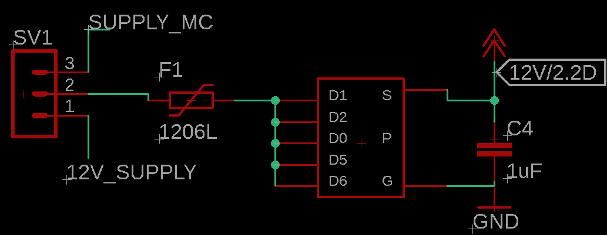

# PCB Explanation

## 1. Power Block

### SUPPLY_MC & 12V_SUPPLY

`SV1`- A connector used to connect the 12V supply to either SUPPLY_MC or 12V_SUPPLY. SUPPLY_MC is specifically used to supply the MC1 and MC2.

* To prevent reverse polarity connection of 12V supply, `TSOP-6` PMOS is used. If the 12V supply is connected with reverse polarity, since the GATE will have high voltage,the PMOS will turn off and prevent connection to the 3 pin header.
* 1&nbsp;μF capacitor is used to prevent voltage spikes.

### Voltage Regulator

`L7805` - A voltage regulator is used to provide a stable 5V output from the 12V supply.

* 0.1&nbsp;μF capacitor is used to prevent voltage spikes. (how do you decide the value of capacitor?)
* `HSS10-B20-P40` heat sink used to dissipate heat from voltage regulator (what are the pins for?)

### 2V5 Voltage Divider

5V is divided down to 2.5V using a voltage divider network consisting of two 5kΩ resistors.

### MC_1 & MC_2

