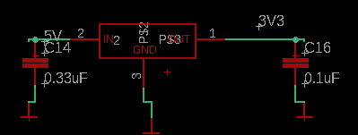

# PCB Explanation

## 1. Power Block

### SUPPLY_MC & 12V_SUPPLY

`SV1`- A connector used to connect the 12V supply to either SUPPLY_MC or 12V_SUPPLY. SUPPLY_MC is specifically used to supply the MC1 and MC2.

* To prevent reverse polarity connection of 12V supply, `TSOP-6` PMOS is used. If the 12V supply is connected with reverse polarity, since the GATE will have high voltage,the PMOS will turn off and prevent connection to the 3 pin header.
* 1&nbsp;μF capacitor is used to prevent voltage spikes.

### Voltage Regulator

`L7805` - A voltage regulator is used to provide a stable 5V output from the 12V supply.

* 0.1&nbsp;μF capacitor is used to prevent voltage spikes. (how do you decide the value of capacitor?)
* `HSS10-B20-P40` heat sink used to dissipate heat from voltage regulator (what are the pins for?)

### 2V5 Voltage Divider

5V is divided down to 2.5V using a voltage divider network consisting of two 5kΩ resistors.

### MC_1 & MC_2

Two PMOS protect from reverse polarity connection of `SUPPLY_MC` & `GND`, and connect `SUPPLY_MC` to `MC_1` & `MC_2`.

* 100&nbsp;μF capacitor is used to prevent voltage spikes.

### AUXILIARY_VOLTAGE_MC1 & AUXILIARY_VOLTAGE_MC2

Both `AUXILIARY_VOLTAGE_MC1` & `AUXILIARY_VOLTAGE_MC2` are kept at a voltage level of 18V via the zener diode.

* `1206-L` fuse is used for overcurrent protection.

## 2. RTDS & Brake-Light BLOCK

`NCV2903` is a open drain Op-Amp. Its floating output is strongly pulled up to 12V via a 10kΩ resistor.

`RTDS_SIG` (HIGH @ 3.3V from the Teensy) pulls down the `OUTPUT_A` to low, which sets `TO_RTDS`(which is otherwise pulled LOW via pulldown resistor) to 12V via the PMOS.

Similarily, `BR_LIGHT_SIG` (HIGH @ 3.3V from the Teensy) pulls down the `OUTPUT_B` to low, which sets `TO_BR_LIGHT`(which is otherwise pulled LOW via pulldown resistor) to 12V from the `SUPPLY_MC` with a fuse (for overcurrent protection) and PMOS (to prevent reverse polarity connection).

## 3. Indication Block

LEDs indicating proper functioning of `5V`, `C+`, `C-` (states mechanical condition,i.e, ON or OFF), `>95%_ACU`, `12V`.

`FROM_BSPD` indicates that everything uptill BSPD works just fine.
`TO_AMS` indicates the ACU that everything is fine untill the ECU.

`RFE_MC` & `FRG_MC` indicate the motor inverters are getting the power supply.

## 4. Connector Block

## 5. Test Points

Test points are provided for easy access to the signals at various stages of the circuit.

## 6. Teensy 4.0 Block

## 7. Motor Controller Block

`NVC2903` works the same way here as it does in the RTDS & Brake-Light block, it sets `RFE_MC` & `FRG_MC` to 12V when the corresponding signals (`RFE` & `FRG`) from the Teensy are HIGH @ 3.3V. Additionally, the `RFE_MC` & `FRG_MC` signals are further divided to `RFE_MC1` & `RFE_MC2`, and `FRG_MC1` & `FRG_MC2` respectively for individual MC.

## 8. 12 to 3V3 Conversion Block

This circuit sets the HIGH signal from `>95%_ACU`, `C+`, and `C-` to LOW (logic TRUE) signal for the Teensy 4.0.

## 9. CAN Transcievers Block

`SN65HVD` CAN Transciever is used for CAN communication between the ECU and other devices in the system.
For Control CAN, it takes input the `C_TX` & `C_RX` signals from the Teensy, gives out `C_CAN_H` & `C_CAN_L` signals for the CAN bus, along with `VREF`. `RS` pulled down to `GND` sets the transciever at High Speed mode which does both transmitting and recieving (as opposed to it may in Sleep mode when `RS` is pulled high).
Similar stuff for Data CAN.

## 10. Voltage Regulator Block

Converts 5V to 3.3V using a voltage regulator.

## 11. ECU Error Block

`LM555N` circuit is used to output `ECU_ERR` from `ECU_MC_ERR_SIG`. 
`THR` = 0, `VCC` = 12V, 
When `ECU_MC_ERR_SIG` is low, `TR` goes low, making it less than 1/3`VCC`, which sets the output to LOW.
When `ECU_MC_ERR_SIG` is high, `TR` goes high, making it greater than 1/3`VCC`, which sets the output to latch to previous output. //
`ERR_RST_DRVR` = 1 by default which doesn affect the output, but when it is pulled low, it sets the `ECU_ERR` output to LOW, reseting the error state.

`RTD_3V3` (from Teensy 4.0) sets `RTD_3V3` to HIGH when the corresponding signal is HIGH, indicating R2D state has been achieved.

## 12. Error Block

// good for nothing relay ig

