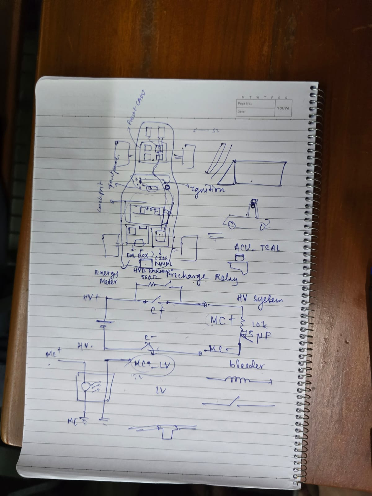
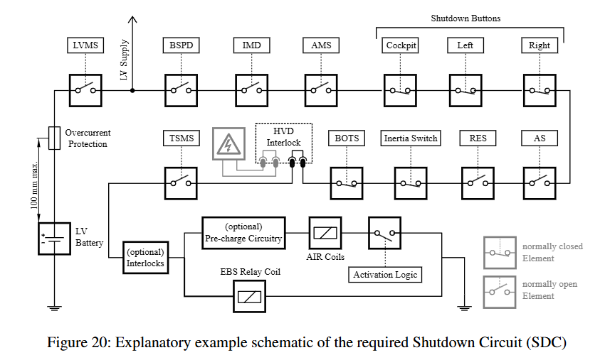

# General Working of the Car

## Startup Sequence

We begin with 2 main switches: LVMS (Low Voltage Main Switch) and TSMS (Tractive System Main Switch).

We close the LVMS switch first, which triggers the green TSAL (Tractive System Active Light) contingent these conditions:
* All AIRs are opened.
* The pre-charge relay is opened.
* The voltage at the vehicle side of the AIRs inside the TSAC does not exceed 60 V DC or 50 V AC RMS.

Then we turn on the TSMS switch, followed by pressing the HV_RESET button (additional logic) which starts the pre-charge process by controlling/powering the AIR coils. First the CON- relay turns on, followed very quickly by PRE-CHARGE relay, and this continues until MC+ and MC- charges to 95%, following which the CON+ relay turns on and completes the charging process.
In this process, the TSAL red light turns on when 60V DC is achieved on MC+ and MC-. Both the TSAL lights are present on the MRH (Main Roll Hoop).

Then we get into R2D state, by pressing the brake pedal and turning the ignition button, which actually sends the RFG and RFE signals to the MC inverter, effectively making the ECU ready to pass on torque values to the MC. The R2D is indicated by a sound buzzer.

We are now ready to drive the vehicle.

## Shutdown Sequence

The driver has a shutdown button at the cockpit (and 2 at his left and right side). When the driver presses the shutdown button, the SDC opens up, triggering the bleeding resistor (discharge resistor present in EM Box) to discharge the capacitors safely. This opens up the AIRs and cutoffs the accumulator from the MC, as well as the LV battery.
Can also use HVD to disconnect the HV from the rest of the car.

To start up again, the driver turns the shutdown button and presses HV RESET.