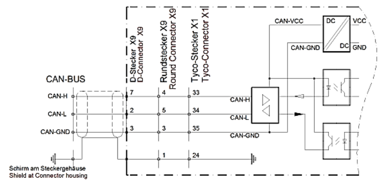
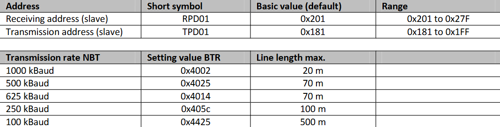

# NDrive CAN-Bus Interface

# A short description of the CAN-Bus interface

1. As standard drive CAN-Bus ***command messages*** are 3 bytes long (16-bit data) or 5 bytes long (32-bit data). 

* Remote Transmit Requests” (RTR) will be ignored. 

* If a 3 byte message (16-bit data) is received and 32-bit data expected, the value will be zero / sign extended as required. 

* If a 5 byte message (32-bit data) is received and 16 bit data expected, the upper data will be thrown away.

2. As standard drive CAN-Bus ***reply messages*** are 4 bytes long (16-bit data) or 6 bytes long (32-bit data).

3. To get the drive to send all replies as 6 byte messages (32-bit data) a bit in RegID 0xDC has to be manually modified.

4. Don’t forget to save using “Write 0” in the Settings window.

## Logic Functions

All UNITEK digital devices have a CAN-BUS interface installed as a Slave.

The CAN-BUS interface is:

* Meant to be connected to a CAN master (like a CNC or SPS controller).

* Opto-decoupled for electrical isolation.

* Powered internally using DC/DC converters.

| Role          | Action            | Purpose                        |
| ------------- | ----------------- | ------------------------------ |
| Master (CNC)  | Sends commands    | To control torque, speed, set current limits, start/stop |
| Slave (Drive) | Sends actual data | Feedback to the master on actual values        |

## CAN-Bus Connections

The CAN-BUS is the digital connection to the CNC control (CAN master). The programming and operation is effected via the CAN-BUS by means of the control panel. Interface acc. to ISO 11898-2.

* The line connection resistance (R = 120Ω) must be installed across the first and the last BUS 
participants between CAN-H and CAN-L.

* The power supply of the CAN-BUS is internally provided via a DC/DC converter.

* The transmission addresses for receiving and sending and the transmission rate are entered via 
the parameter field ‘CAN-Setup’ of the pc program NDrive.

## Format Description

1. Numerical format:
Parameter value and parameter no. as Little-Endian format (Intel format) 

Bit7 to 0 / Bit15 to 8 / Bit23 to 16 / Bit31 to 24  

2. CAN format:
The CAN protocol is a ***3 or 5 byte*** data package when received and ***4 or 6*** when send. It is also possible to receive data packages of up to 8 byte. In this case, however, it is evaluated as
***5 Byte*** data package. The identifier is ***11Bit*** wide. It comprises the ***COB identifier***, the RTR function (***Remote Transmission Request***) and the DLC information (***Data Length Code***).

The byte 0 of the data field is for the ***REGID index (parameter no.)***. The second to the fifth byte (byte 1 to byte 4) contains the data of the REGID index (parameter
value).

