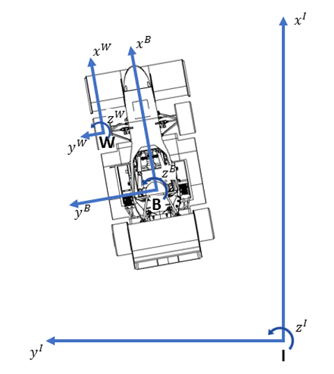
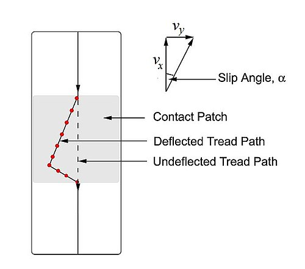
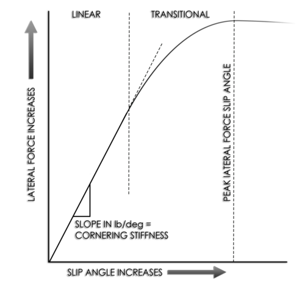
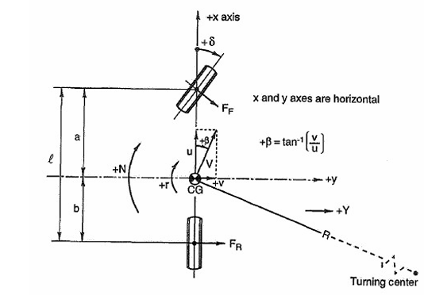

# Torque Vectoring

This study explores an advanced vehicle control technology known as Torque Vectoring (TV), particularly effective for electric vehicles. By dynamically adjusting the torque delivered to individual wheels, the system enhances vehicle stability and responsiveness while maintaining safety and driving comfort. 

Reference used: [Thesis on Torque Vectoring by João Pedro Marques Antunes](https://fenix.tecnico.ulisboa.pt/downloadFile/563345090415567/Dissertacao.pdf)

## Introduction

Traditional steering systems often result in delayed and less precise vehicle responses, partly due to tire deformation before sufficient turning force is generated. Torque vectoring addresses this issue by adjusting the power or braking force between the left and right wheels. This creates a rotational force (yaw moment) that helps the vehicle turn more quickly and accurately, improving overall handling.

## Vehicle Dynamics

Vehicle dynamics is the area devoted to the development of models that describe the behaviour of a
vehicle for any given set of inputs and disturbances. Modelling this type of system is a very complex and
challenging task. A lot of different approaches and models can be used depending on the needs of the
user.

The vehicle model used to study a torque vectoring control system will typically have seven degrees
of freedom. The lateral and longitudinal velocities of the vehicle ($v_x$ and $v_y$ respectively) and the yaw rate
are three degrees of freedom related to the vehicle body. The wheel velocities of the four wheels, the
front left wheel ($w_{fl}$), front right wheel ($w_{fr}$), rear left wheel ($w_{rl}$) and rear right wheel ($w_{rr}$) constitute the other four degrees of freedom.

### 1. Vehicle Model

To obtain the vehicle dynamics, the vehicle is simplified to a mass m at the center of gravity (CG) and a
moment of inertia Izz. To describe the model, 3 cartesian coordinate frames are necessary:
* The inertial coordinate frame, denoted by the **upper-script I**, is a fixed frame with the origin placed at any point and the orientation that is most convenient to the user. This frame is useful when analyzing the trajectory of the vehicle, which is the path taken from an initial time to a final time seen by an observer in a static point.
* The body fixed coordinate system, with the **upper-script B**, has the origin in the center of mass of the vehicle. The x-axis is in the longitudinal direction of the vehicle, the y-axis is towards the left of the vehicle and the z-axis points upwards. The rotations about the x, y, z-axis are called roll, pitch and yaw, respectively.
* The wheel fixed coordinate system, denoted by the **upper-script W**, with the origin at the center of each wheel. The x, y, z-axis have the same direction and orientation as the body fixed system. The vehicle in study has 4 wheels, so there will be a fixed coordinate system attached to each wheel.

### 2. Vehicle Trajectory

The transformation from the
vehicles’ frame to the inertial frame (IRB), the Euler angle rotation matrix is used:
(Note: we are only interested in studying the movement in the xy plane, which means that null roll and pitch are assumed)
$
^I R_B =
\begin{bmatrix}
\cos(\psi) & -\sin(\psi) & 0 \\
\sin(\psi) & \cos(\psi) & 0 \\
0 & 0 & 1
\end{bmatrix}
$

The path of the vehicle will be obtained by the integration of the vehicle’s velocity $^B v$ with respect to time, and rotated to the inertial frame $^I v$, by a yaw angle ($\psi$).

$
^I v = ^I R_B * ^B v =
\begin{bmatrix}
^B \dot x  \cos(\psi) - ^B \dot y \sin(\psi) \\
^B \dot x \sin(\psi) + ^B \dot y \cos(\psi) \\
0
\end{bmatrix}
$

The position of the car is therefore defined by the previous position ($x_0$) and the distance covered in the x and y direction between time $t_0$ and $t$:

$^I x = ^B x_0 + \int_{t_0}^{t} (^B \dot x \cos(\psi) - ^B \dot y \sin(\psi)) dt$ 
$^I y = ^B y_0 + \int_{t_0}^{t} (^B \dot x \sin(\psi) + ^B \dot y \cos(\psi)) dt$

The rotation of the car can be described by the previous rotation summed with the rotation in the same time interval:

$^I \psi = ^I \psi_0 + \int_{t_0}^{t} \dot \psi dt$

### 3. Equations of Motion

The resultant of external forces and moments that the vehicle receives from the ground and environ
ment, constitutes the vehicle force system.

The longitudinal force, $F_x$ is the resultant force acting along the x-axis. If $F_x > 0$ then the car is
accelerating and if $F_x < 0$ then the vehicle is braking. 
$F_y$ represents the total lateral force. If the force is positive, it points to the left, from the drivers view point. 
The yaw moment $M_z$, is an upward moment about the z-axis. If the resultant moment is positive the car
will turn left, if it’s negative it will turn to the right

### 4. Slip Angle and Cornering Force

**Slip angle** or **sideslip angle** is the angle between the direction in which a wheel is pointing and the direction in which it is actually traveling. This is the angle between the forward velocity vector $v_x$ and the vector sum of wheel forward velocity $v_x$ and lateral velocity $v_y$. This slip angle results in a force, called the **cornering force**, which is in the plane of the contact patch and perpendicular to the intersection of the contact patch and the midplane of the wheel. The cornering force increases approximately linearly for the first few degrees of slip angle, then increases non-linearly to a maximum before beginning to decrease.

$\alpha \triangleq -\arctan \left(\frac{v_{y}}{|v_{x}|}\right)$

Cornering stiffness states the amount of 
cornering force $F_y$ given by the tires with the variation of tire slip angle $\alpha$, this is valid 
only in the linear region of the tire behaviour.
The value of the cornering stiffness of rear tires is higher because the vertical load 
on them is higher, so the chart for rear wheels 
has a higher starting slope. 

Refer to these videos for crystal clear understanding of the concept:
- [Vatsal Jain](https://youtu.be/1k-sCL0SeRQ?si=VbAnHNUynghROf4L)
- [driving 4 answers](https://youtu.be/MwrUz1WI5GY?si=xpiiEJnNCQTYJCZG)

### 2 DOF Vehicle Model

To completely define the dynamics behaviour of a car a high number of degrees of 
freedom (DOF) is usually needed. Some assumptions can be made to simplify the model and 
obtain a **2 DOF model** of the vehicle. The hypothesis considered are the following:

- Flat road that can be considered a geometrical plane
- Avoid rapid accelerations and braking conditions so to neglect the
pitch movement of the vehicle - - -
- Rigid body structure of the vehicle
- Rigid suspensions
- Neglect inertial effects due to roll motion. Racing cars have normally
high values of suspension stiffness so that the roll motion can be neglected
- Flat motion of the vehicle
- Rigid steering system
- Small angles of the steering wheels

It’s important to notice that two other important assumptions must be made to
properly use this model: 
1. Equal steering angles of the two front wheels: $𝛿 = 𝛿_{fl} ≈ 𝛿_{fr}$
2. Small tire slip angles to be able to consider the linear tire model of tires

### Designing the Control Architecture

Control Strategy Selection:

A PID-based torque vectoring controller is chosen for its simplicity and effectiveness in real-time applications.

Control Structure:

1. **Reference Yaw Rate Generator** – Computes the desired yaw rate based on steering angle and speed.

Reference: [Thesis on Torque Vectoring by Andrea Fricano](https://webthesis.biblio.polito.it/12157/1/tesi.pdf)

$\dot{\psi}_{des} = \frac{V_{x} \cdot \delta}{L + K_{u} \cdot (V_x)^2}$

Where:
- $V_x$ is the longitudinal speed of the vehicle
- $\delta$ is the steering angle
- $L$ is the wheelbase of the vehicle
- $K_u$ is a constant that depends on the vehicle's geometry and tire characteristics

$K_{us} = \frac{m}{L} \left( \frac{l_r}{C_{\alpha f}} - \frac{l_f}{C_{\alpha r}} \right)$

$\dot{\psi}_{max} = \frac{\mu \cdot g}{V_x}$

$\dot{\psi}_{ref} = \text{min}\left( |\dot{\psi}_{des}|, \dot{\psi}_{max} \right) \cdot \text{sign}(\delta)$

2. **Yaw Rate Error Calculation** – Compares actual vs. desired yaw rate.

3. **PID Controller** – Adjusts torque distribution to minimize error.

4. **Torque Allocation** – Distributes torque between left and right wheels.

